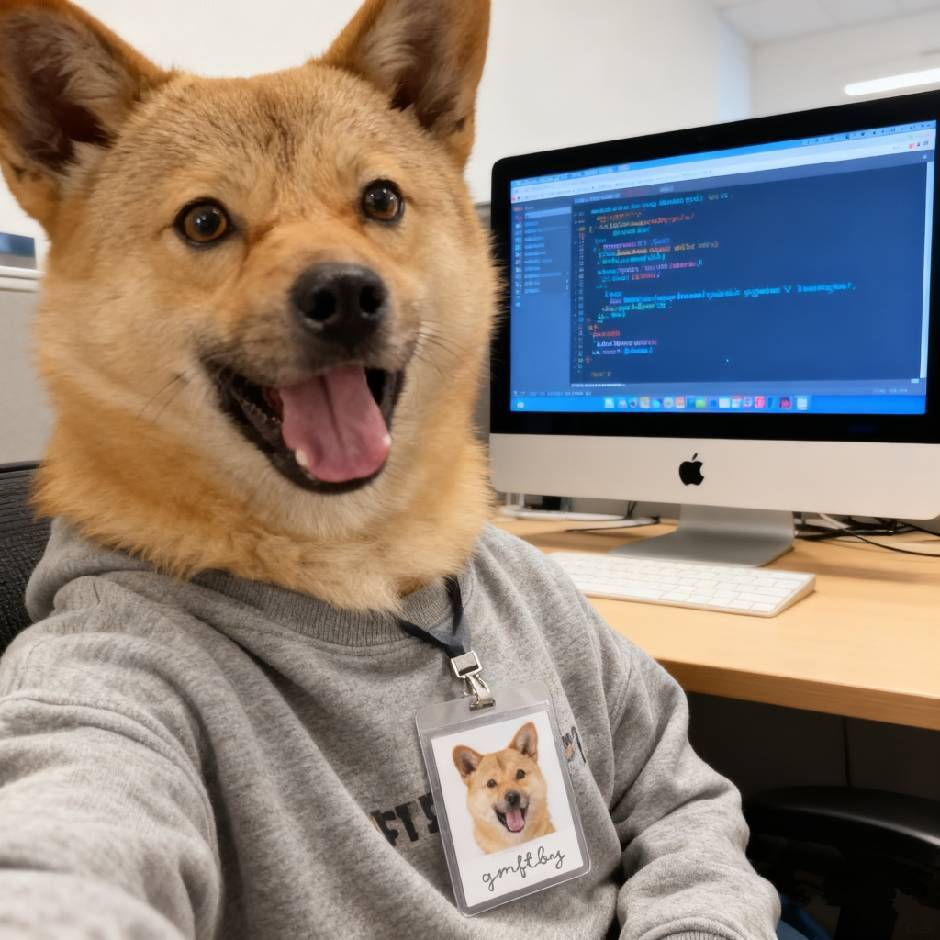

# 个人学术主页模板

一个纯 HTML / CSS / JS 编写的个人学术主页模板，参考了 [genezc7.github.io](https://genezc7.github.io/) 的经典学术主页布局（左侧固定简介栏 + 右侧内容区 + 时间轴），并做了更清新现代的视觉重制：自定义配色、圆角卡片、深色模式、移动端自适应。

不依赖 Jekyll / Node.js / 任何构建工具，直接是静态文件，可以直接用浏览器打开，也可以直接托管在 GitHub Pages 上。

## 目录结构

```
.
├── index.html              # 唯一的页面，所有内容都在这里
├── assets/
│   ├── css/style.css       # 全部样式（配色变量在文件顶部 :root 里）
│   ├── js/main.js          # 深色模式切换 / 移动端导航 / 滚动高亮 / 淡入动画
│   ├── img/
│   │   └── favicon.svg     # 网站小图标（占位版，可替换）
│   └── files/
│       └── talks/          # 学术报告的 slides 等附件
└── README.md                # 就是你正在看的这份文档
```

## 一、本地预览

在项目根目录下，用终端运行（Mac 自带 Python 3）：

```bash
python3 -m http.server 8080
```

然后浏览器打开 `http://localhost:8080` 即可看到效果。修改文件后刷新浏览器就能看到变化，不需要重启服务。

> 也可以在 Cursor / VS Code 里装一个 "Live Server" 插件，右键 `index.html` -> "Open with Live Server"，效果一样，还能自动刷新。

## 二、把内容改成你自己的

打开 `index.html`，从上到下按板块修改即可，每个需要改的地方我都写了placeholder（例如 `Your Name`、`[your position]`、`#` 链接）。具体对照如下：

| 板块 | 在文件中查找 | 需要改什么 |
|---|---|---|
| 头像 | `avatar avatar--placeholder` | 有真实照片后，把这个 `<div>` 换成 ``，并把照片放进 `assets/img/` |
| 姓名/头衔/单位/简介 | `sidebar__name` 等 | 直接改文字 |
| 社交链接 | `sidebar__socials` | 把每个 `<a href="...">` 换成你自己的 Email / GitHub / Google Scholar 链接 |
| About Me | `id="about"` | 两三段个人学术背景介绍 |
| Recent Highlights | `id="highlights"` | 每条一个 `<li>`，时间倒序，用来记录论文中稿、获奖、任职变动等动态 |
| Education | `id="education"` | 每条学历一个 `.edu-item` |
| Experience | `id="experience"` | 时间轴，`.timeline__item--left` 和 `--right` 交替出现即可左右交替展示；不想交替就都用同一个方向。每条可以在 `.timeline__org` 里加一个 `.timeline__logo-badge`（内部放 ``）展示单位 logo，logo 图片放在 `assets/img/logos/` 下 |
| Publications | `id="publications"` | 每篇论文一个 `<article class="pub">`，`badge` 是会议/期刊名，`pill` 是各种链接按钮 |
| Projects | `id="projects"` | 每个项目一个 `.project-card`，`.tag` 是技术标签 |
| Awards / Talks | `id="awards"` / `id="talks"` | 简单列表，照着现有格式加行即可 |
| Contact | `id="contact"` | 邮箱和社交链接 |

改的时候不需要动 CSS 和 JS，纯改 `index.html` 里的文字和链接就够用。

### 换头像

1. 把你的照片放进 `assets/img/`，比如叫 `avatar.jpg`（正方形照片效果最好）。
2. 在 `index.html` 里找到：
   ```html
   <div class="avatar avatar--placeholder" aria-hidden="true">YN</div>
   ```
   换成：
   ```html
   
   ```

### 换主题色

打开 `assets/css/style.css`，最上面 `:root` 里的：

```css
--accent: #2f9e6f;       /* 主题色 */
--accent-soft: #e6f5ee;  /* 主题色的浅色背景 */
```

换成你喜欢的颜色即可，全站会自动联动（按钮、链接、时间轴圆点、标签等）。深色模式的配色在下面的 `[data-theme="dark"]` 里，同理修改。

### 换网站图标 (favicon)

`assets/img/favicon.svg` 是一个简单的圆形字母图标，可以用任意图片/设计工具替换成自己的 logo，保持文件名 `favicon.svg` 不变即可，或者改成别的文件名后同步修改 `index.html` 里 `<link rel="icon">` 那一行。

## 三、部署到 GitHub Pages（从零开始，手把手）

GitHub Pages 是 GitHub 提供的免费静态网站托管服务，专门用来放这种个人主页。你选择的是 **`<用户名>.github.io`** 这种"个人主页仓库"，是最简单、地址最干净的方式（比如 `qihui.github.io`）。

### 第 1 步：确认本地已安装 git

打开终端，运行：

```bash
git --version
```

如果显示版本号（比如 `git version 2.39.x`），说明已经装好了，直接跳到第 2 步。如果提示没有该命令，macOS 会自动弹窗提示安装 Xcode Command Line Tools，点安装即可。

### 第 2 步：在 GitHub 上创建仓库

1. 登录 [github.com](https://github.com)，如果还没有账号先注册一个。
2. 点右上角 `+` -> `New repository`。
3. **仓库名必须是 `你的GitHub用户名.github.io`**（全部小写），例如用户名是 `qihui`，仓库名就填 `qihui.github.io`。这个命名是 GitHub Pages 的硬性规定，写错了网站不会在根域名生效。
4. 其余保持默认（不要勾选 "Add a README file"，因为我们本地已经有内容了），点击 `Create repository`。
5. 创建后 GitHub 会给你看一个空仓库的提示页面，先别关，等下要用到里面的远程仓库地址。

### 第 3 步：把本地项目变成 git 仓库并推送上去

在项目根目录（也就是这个文件夹）下，依次执行：

```bash
git init
git add .
git commit -m "Initial commit: academic homepage"
git branch -M main
git remote add origin https://github.com/你的用户名/你的用户名.github.io.git
git push -u origin main
```

把上面命令里的 **"你的用户名"** 换成你真实的 GitHub 用户名（两处都要换）。

第一次 push 时，如果弹出登录窗口，用你的 GitHub 账号登录授权即可（GitHub 现在大多要求用 Personal Access Token 或者浏览器弹窗授权，跟着提示走就行）。

### 第 4 步：等待并访问网站

推送成功后，打开浏览器访问：

```
https://你的用户名.github.io
```

对于 `用户名.github.io` 这种仓库，GitHub Pages 默认是**自动开启**的，不需要额外去 Settings 里配置，通常 30 秒到 2 分钟内就能访问到（如果打不开，等一两分钟再刷新，或者去仓库的 `Settings -> Pages` 检查一下部署状态，正常会显示一个绿色的 "Your site is live at ..."）。

### 第 5 步：以后怎么更新内容

以后每次修改了 `index.html` 或样式，想更新到线上，只需要：

```bash
git add .
git commit -m "说明这次改了什么，比如：更新论文列表"
git push
```

推送后一两分钟，线上网站会自动更新，不需要重新配置任何东西。

## 四、常见问题

**Q: 改了 CSS/图片，刷新网页却没变化？**
浏览器缓存导致的，强制刷新一下（Mac 上 `Cmd + Shift + R`），或者换个无痕窗口打开看看。

**Q: 图片/图标不显示？**
检查路径大小写是否完全一致 —— GitHub Pages 服务器对大小写敏感，本地 macOS 默认不敏感，所以本地能显示、线上却 404 的最常见原因就是文件名大小写对不上（比如 `Avatar.jpg` vs `avatar.jpg`）。

**Q: 想用自己的域名（比如 yourname.com）而不是 xxx.github.io？**
在仓库根目录加一个叫 `CNAME` 的文件（无后缀），里面写你的域名，再去你的域名服务商那边把 DNS 解析指向 GitHub Pages 的服务器即可。这个是进阶操作，需要的话告诉我，我再帮你配置。

**Q: 想加统计访问量的功能？**
可以接入 Google Analytics 或者不蒐集隐私的 [Umami](https://umami.is/) / [Plausible](https://plausible.io/)，把它们提供的一小段 `<script>` 粘贴到 `index.html` 的 `</head>` 之前即可，需要的话告诉我帮你接入。

## 五、这个模板和参考页面的关系

参考的 [genezc7.github.io](https://genezc7.github.io/) 用的是 GitHub 官方 "Minimal" 主题（基于 Jekyll），这个模板在**布局结构**上向它致敬（侧边简介栏 + 时间轴 + 分板块展示），但做了这些改进：

- 不依赖 Jekyll/Ruby，纯静态文件，改起来更直接、部署也更简单；
- 重新设计了配色和圆角卡片风格，更清新；
- 加入了深色模式一键切换；
- 加入了滚动时导航高亮、板块淡入动画等小细节；
- 移动端做了专门的自适应布局（原主题在手机上体验一般）。
